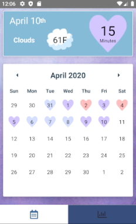
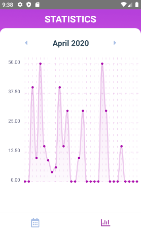

# JTrack - Fitness Tracking App

Website: https://kinern.github.io/jtrack

React Native App with "Don't Break The Chain" style fitness tracker.  
Originally for jump roping, modified to store minutes of execise instead of repetitions.

### Features
- "Don't Break The Chain" style calendar with images to indicate minutes.
- Hearts on each day workout exercise was done, changes color depending on number of minutes.
- Stats screen with graph of recorded entires.
- Local Weather using OpenWeatherMap Weather API and geoLocation.

---

### Requirements
#### OpenWeatherMap API
The weather part of the calendar screen requires an OpenWeatherMap API key.  
Once you have an API key, it should be put new file named "api.js" in the parent folder.  
api.js should contain the following line:  
export const weather_api_key = 'WEATHER_KEY_HERE';  

---

### Uses the following
- [React Native Calendars](https://github.com/wix/react-native-calendars)
- [React Native Chart Kit](https://github.com/indiespirit/react-native-chart-kit)
- [React Native Geolocation Service](https://github.com/Agontuk/react-native-geolocation-service)
- [React Native SQLite Storage](https://github.com/andpor/react-native-sqlite-storage)
- [React Navigation](https://github.com/react-navigation/react-navigation)
- [OpenWeatherMap Weather API](https://openweathermap.org/api)

---

### Screenshots

